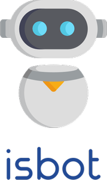

# isbot


Rust library to detect bots using a user-agent string. 

#### Features

- Focused on speed, simplicity, and ensuring real devices and browsers don't get falsely identified as bots
- Includes a default collection of 300+ known bot user-agent regular expressions at compile time

## Usage

Add this to your `Cargo.toml`:

```toml
[dependencies]
isbot = "0.1.0"
```

The example below uses the default bot patterns to correctly identify the `Googlebot-Image` user-agent as a bot and the `Opera` user-agent as a browser.

```rust
use isbot::Bots;

let bots = Bots::default();

assert_eq!(bots.is_bot("Googlebot-Image/1.0"), true);
assert_eq!(bots.is_bot("Opera/9.60 (Windows NT 6.0; U; en) Presto/2.1.1"), false);
```

## Philosophy
Bot detection is a gray area since there are no clear lines on what defines a bot user-agent and a real device user-agent. Some libraries focus on broadly classifying bots and trying to identify as many as possible, with the risk that some real devices may be caught and falsely flagged as bots.

This library's focus is on identifying known bots while primarily ensuring no real users or devices are falsely flagged. All of the bot user-agent patterns are validated against a large number of real devices and bot patterns to ensure devices are not incorrectly identified.

For example, the user-agent string below is identified as both a bot and a real device by various libraries and data sources:

```javascript
Mozilla/5.0 (Linux; Android 4.2.1; CUBOT GT99 Build/JOP40D) AppleWebKit/535.19 (KHTML, like Gecko) Chrome/18.0.1025.166 Mobile Safari/535.19
````

- *myip.ms* identifies it as a [bot](https://myip.ms/view/web_bots/1742760/Known_Web_Bots_Mozilla_5_0_Linux_Android_4_2_1_CUBOT_GT99_Build_JOP40D_AppleWebKit_535_19_KHTML_like_Gecko_Chrome_18_0_1025_166_Mobile_Safari_535_19.html)

- *user-agents.net* identifies it as a [browser](https://user-agents.net/string/mozilla-5-0-linux-android-4-2-1-cubot-gt99-build-jop40d-applewebkit-535-19-khtml-like-gecko-chrome-18-0-1025-166-mobile-safari-535-19)


## Testing

### Unit and integration tests
To test the full test suite of unit and integration tests, run:

```bash
cargo test
```

# Credits
There are many excellent bot detection libraries available for other languages and awesome developers maintaining bot and user-agent identification data. This library draws inspiration from many of them, especially:
| Library  | Language |
| ------------- | ------------- |
| https://github.com/omrilotan/isbot   | JavaScript  |
| https://github.com/JayBizzle/Crawler-Detect/  | PHP  |
| https://github.com/matomo-org/device-detector | PHP |
| https://github.com/fnando/browser | Ruby |
| https://github.com/biola/Voight-Kampff | Ruby |


The following data sources are used directly or as inspiration for the static test data and downloaded user-agent identification:
| Data Source  | Notes |
| ------------- | ------------- |
| https://user-agents.net/bots | User Agents Database |
| https://myip.ms/files/bots/live_webcrawlers.txt   | List of IP addresses of Known Web Bots & Spiders in Myip.ms Database |
| https://github.com/monperrus/crawler-user-agents   | Collection of user-agents used by robots, crawlers, and spiders  |
| https://github.com/ua-core | Regex file necessary to build language ports of Browserscope's user agent parser| 


## License
`isbot` is distributed under the terms of the MIT license. See [LICENSE](./LICENSE) for details.